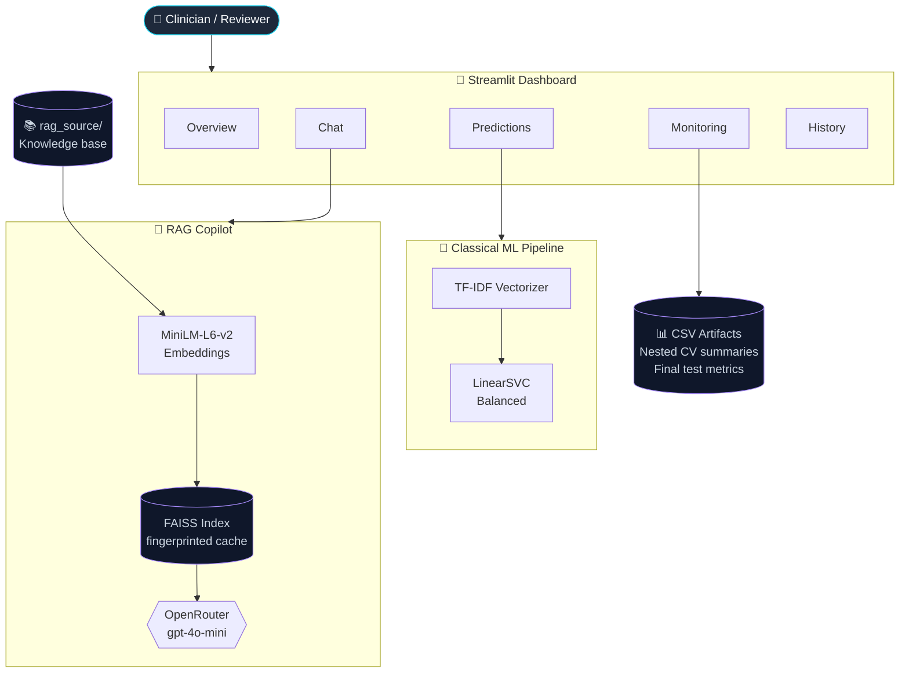

<div align="center">

# 🧠 Mental Health Intelligence

### Clinical-grade NLP triage with statistically robust ML and grounded LLMs

[](https://www.python.org/)
[](https://streamlit.io/)
[](https://scikit-learn.org/)
[](https://www.langchain.com/)
[](https://github.com/facebookresearch/faiss)
[](https://docs.pytest.org/)
[](LICENSE)

**An early-screening decision-support tool that combines a Nested-CV-validated classical ML baseline with a Retrieval-Augmented LLM copilot — wrapped in a glassmorphism Streamlit dashboard.**

[Quickstart](#-quickstart) · [Architecture](#-architecture) · [Methodology](#-methodology) · [Dashboard](#-dashboard) · [Ethics](#-ethics--limitations)

</div>

> [!WARNING]
> **Non-diagnostic disclaimer.** This system is a clinical decision-support aid. It must **never** replace a licensed clinician's judgement, and is not certified as a medical device under the EU MDR or equivalent frameworks.

---

## 🎯 The Problem

How do you triage mental-health-related text — patient narratives, social posts, intake forms — across **seven overlapping clinical categories** (ADHD, Anxiety, Autism, Bipolar, BPD, Depression, Schizophrenia) when:

- the classes are **imbalanced** (some are 5× rarer than others),
- the linguistic differences are **semantically subtle**, and
- false negatives on high-risk classes (Bipolar, Schizophrenia) carry asymmetric clinical cost?

This project answers that question with a system designed for **rigorous evaluation first, deployment second**.

---

## 🏗 Architecture



**Three independent reasoning paths**, each with strict isolation:

| Path | Trigger | Privacy boundary |
|---|---|---|
| **Local ML inference** | `Predictions` page | Runs entirely offline. No text leaves the host. |
| **RAG over project docs** | `Chat` page (default) | Embeddings local; only retrieved chunks + question sent to LLM. |
| **Direct LLM fallback** | RAG returns no context | Question sent to OpenRouter only when retrieval fails. |

---

## 🔬 Methodology

### Statistical rigour: **Nested Cross-Validation**

Most ML benchmarks suffer from **selection bias** — hyperparameters tuned on the same folds used to report accuracy. We use a nested loop:

```
Outer K-Fold (test estimate)
└── Inner K-Fold (GridSearch on train fold only)
    └── Champion config promoted, refit on full train fold, scored on held-out test fold
```

The result is an **unbiased estimate** of generalisation error — what the model would actually do on never-seen text.

### Champion model: **LinearSVC + class-balanced weighting**

A deliberately simple choice. The transformer benchmarks (`03_transformers_benchmark.ipynb`) showed that on this dataset, MentalBERT marginally outperforms LinearSVC on macro-F1 but **at 40× the inference cost** and with worse interpretability. For a triage tool that must be auditable in clinical settings, **LinearSVC wins**.

### Optimisation target: **Critical Recall**

We deliberately don't optimise macro-F1 alone. Missing a Bipolar or Schizophrenia signal has real-world cost; mis-routing a Depression case to Anxiety is recoverable downstream. The metric reported in `final_test_metrics.csv` weights recall on critical classes (`Bipolar`, `Schizophrenia`) higher than the rest.

---

## 🎨 Dashboard

A six-page Streamlit application with a custom glassmorphism theme:

| Page | What it does |
|---|---|
| **Overview** | Live dataset stats, class badges, headline metrics from the latest evaluation run. |
| **Predictions** | Paste any text → real-time classification, probability bars, confidence read-out. Falls back to a clearly-labelled keyword-based demo when no `.joblib` model is loaded. |
| **Monitoring** | Renders the actual evaluation artifacts (nested CV summary, final test metrics, clinical review CSV) — no fake numbers. |
| **Chat** | RAG-powered Q&A grounded in `rag_source/`. Cites sources. Falls back to direct OpenRouter on retrieval miss. |
| **History** | Session-scoped log of recent predictions. Cleared on browser refresh — no persistence. |
| **About** | Project context, ethical framing, roadmap. |

> 📸 **Screenshots:** add yours to `docs/screenshots/` and reference them here. Suggested:
> `docs/screenshots/01-overview.png`, `02-predictions.png`, `03-chat-rag.png`, `04-monitoring.png`.

---

## 🚀 Quickstart

### Prerequisites

- **Python 3.10+**
- An [OpenRouter](https://openrouter.ai/) API key (free tier sufficient for `gpt-4o-mini`)
- ~2 GB disk for embedding model + FAISS index on first run

### Install

```bash
git clone https://github.com/anafiiliipa-dev/Mental_health_detection.git
cd Mental_health_detection

python -m venv .venv
source .venv/bin/activate          # Windows: .venv\Scripts\activate

pip install -e ".[streamlit]"      # core + dashboard
# or:
pip install -e ".[dev]"            # core + tests + linters
```

### Configure secrets

```bash
cp .env.example .env
# Edit .env and set OPENROUTER_API_KEY
```

The repo **never** commits `.env` — only `.env.example` (placeholder). Confirmed by `.gitignore`.

### Run

```bash
streamlit run src/mental_health/app/app.py
```

Visit `http://localhost:8501`.

### Test

```bash
pytest -v
```

Expected: **26 tests pass** across `test_predictions.py`, `test_rag.py`, `test_client.py`. All external services (OpenRouter, FAISS) are mocked — no network or API key required.

---

## 📁 Project Structure

```
mental-health-intelligence/
├── .github/workflows/ci.yml        # pytest + ruff on every PR
├── .env.example                    # placeholder secrets
├── .gitattributes                  # forces LF, marks notebooks
├── .gitignore                      # data/, models/, reports/, .env, *.joblib
├── pyproject.toml                  # single source of truth for deps
├── README.md
├── LICENSE                         # MIT
│
├── docs/
│   ├── architecture.md             # design decisions and trade-offs
│   └── screenshots/                # dashboard captures for the README
│
├── notebooks/                      # 1️⃣ → 5️⃣ pipeline, runnable end-to-end
│   ├── 01_data_cleaning.ipynb
│   ├── 02_classical_ml_benchmark.ipynb       # ← Nested CV champion
│   ├── 02b_smote_sensitivity.ipynb           # ← class-imbalance ablation
│   ├── 03_transformers_benchmark.ipynb       # ← Colab/GPU
│   ├── 04_clinical_evaluation.ipynb
│   └── 05_deployment_mvp.ipynb
│
├── src/mental_health/              # installable package
│   ├── app/
│   │   ├── app.py                  # Streamlit entry point
│   │   ├── pages/                  # one module per dashboard page
│   │   ├── styles.py               # custom CSS
│   │   └── llm/openrouter_client.py
│   ├── config/paths.py             # centralised path constants
│   ├── model/services.py           # load_model, predict_with_model
│   └── rag/simple_rag.py           # FAISS + LangChain retrieval
│
├── tests/                          # pytest, fully mocked
│   ├── conftest.py
│   ├── test_predictions.py
│   ├── test_rag.py
│   └── test_client.py
│
├── rag_source/                     # knowledge base for the Chat page
└── data/  models/  reports/        # gitignored (local only)
```

---

## 🧪 Notebook pipeline

| # | Notebook | Purpose | Runtime |
|---|---|---|---|
| 01 | `data_cleaning` | Text normalisation, near-duplicate detection, train/val/test export | CPU, ~2 min |
| 02 | `classical_ml_benchmark` | TF-IDF + LinearSVC, **Nested CV**, champion selection | CPU, ~15 min |
| 02b | `smote_sensitivity` | Tests whether oversampling improves recall on critical classes | CPU, ~5 min |
| 03 | `transformers_benchmark` | BERT base + MentalBERT, fair head-to-head with the classical baseline | **GPU recommended** |
| 04 | `clinical_evaluation` | Per-class confusion matrices, error analysis, clinical review tables | CPU, ~3 min |
| 05 | `deployment_mvp` | LLM perspectives, MVP wiring | CPU, ~2 min |

> Run 03 and 05 on Google Colab via the badge at the top of each notebook.

---

## 🛡 Ethics & limitations

- **Non-diagnostic.** Repeated everywhere it matters. Outputs are signals for human review, not labels.
- **Privacy.** Classical inference is fully local. The RAG layer only sends *retrieved chunks plus the user's question* to OpenRouter — never raw patient text. The `Predictions` page never calls any external API.
- **Recall-skewed.** We accept more false positives in exchange for fewer false negatives on high-risk classes. This is a deliberate clinical trade-off, not a bug.
- **Data provenance.** The training data is derived from publicly available text; no clinical records were used. The model **has not been validated on clinical populations** and is not certified for clinical use.
- **Bias.** As with any text classifier, performance varies across demographics, dialects, and clinical sub-populations. The error analysis in notebook 04 surfaces these gaps; do not deploy without re-validating on your population.

---

## 🤝 Contributing

This is a portfolio project, but issues and PRs are welcome. Please:
1. Run `pytest -v` and `ruff check .` before opening a PR.
2. Use [Conventional Commits](https://www.conventionalcommits.org/) (`feat:`, `fix:`, `docs:`, `refactor:`, `test:`).
3. If you touch a notebook, run `nbstripout <file>.ipynb` to avoid bloating diffs with execution outputs.

---

## 👥 Authors

**Ana Gouveia & Nicolas Moignard** — DSFS-OD-14 cohort

---

## 📄 License

MIT — see [LICENSE](LICENSE).
